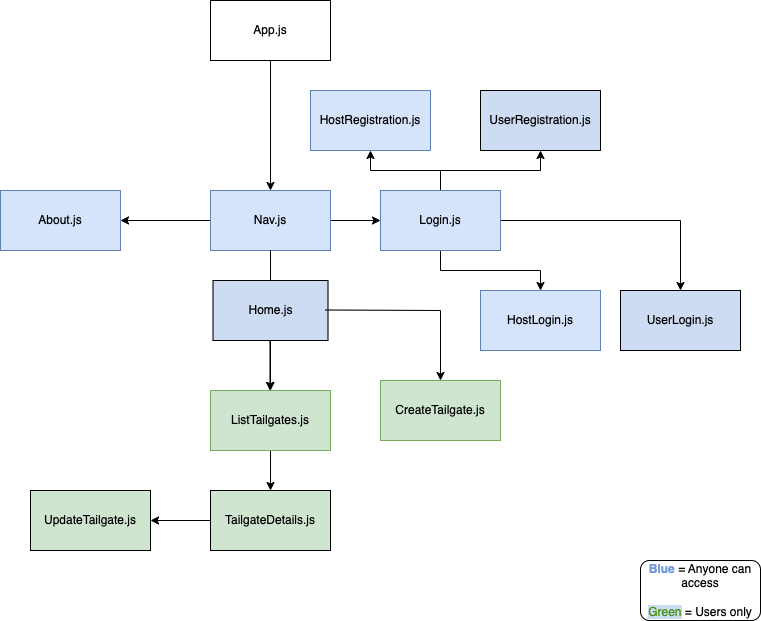
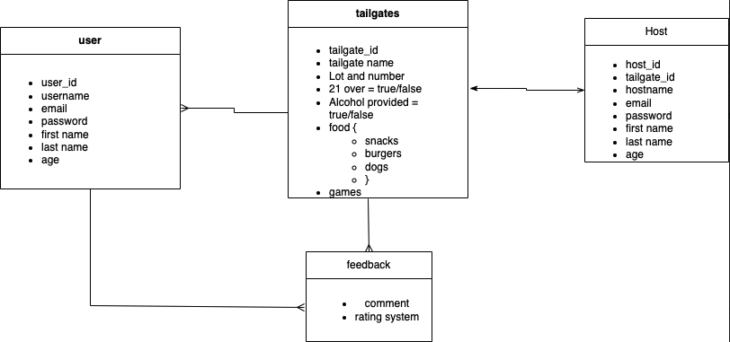

# TailGreat-FrontEnd

## _SEI 9-19 Capstone Project_

## Date: Dec 7, 2022

### By: Jeff Carroll

### [GitHub](https://github.com/jcarr048) | [LinkedIn](https://www.linkedin.com/in/jeff-carroll-dev/)

### [Trello Board](https://trello.com/b/vSLiM4x4/capstone-project) | [Backend Repo](https://github.com/jcarr048/Carroll-TailGreat-Backend) | [Deployed Site](https://tailgreat-app.herokuapp.com/)

### **_Description_**

TailGreat's purpose is to serve fans who wish to host or join tailgate party's for sporting events. There is nothing quite like joining with friends before, during, and after a professional sporting event for drinks, food, and good times. Get ready for the big game by either registering your tailgate to allow others to join or find one that matches your preferences!

###

## **_Technologies_**

### Pern Stack

- React
- Node
- JavaScript
- PostgresSQL
- Sequelize
- CSS

---

### **_Screenshots_**

####

---

### **_Future Updates_**

####

- [ ] Interactive Parking Lot Map
- [ ] Sign up for tailgates
- [ ] Have hosts declare what they need brought to tailgate

####

---

### **_Credits_**
